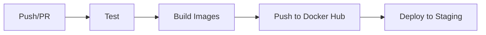
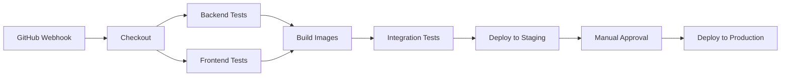

# Virtual Stock Trading App - CI/CD Implementation

This project now includes comprehensive CI/CD pipelines using both **GitHub Actions** and **Jenkins** for automated testing, building, and deployment.

## 🚀 Quick Start

### GitHub Actions
1. Push your code to GitHub
2. The pipeline automatically runs on every push/PR
3. Check the Actions tab in your GitHub repository

### Jenkins
1. Set up Jenkins on localhost:8080
2. Follow the [Jenkins Setup Guide](docs/JENKINS-SETUP.md)
3. Create a pipeline job using the provided Jenkinsfile

## 📁 Project Structure

```
virtual-stock-trader-app/
├── .github/
│   └── workflows/
│       └── ci-cd.yml              # GitHub Actions workflow
├── docs/
│   ├── CI-CD-SETUP.md            # Complete CI/CD setup guide
│   └── JENKINS-SETUP.md          # Jenkins-specific setup guide
├── scripts/
│   ├── deploy.sh                 # Linux/Mac deployment script
│   ├── deploy.ps1                # Windows PowerShell deployment script
│   └── test.sh                   # Testing script
├── docker-compose.ci.yml         # CI/CD testing environment
├── docker-compose.run.yml        # Local development environment
├── docker-compose.prod.yml       # Production environment
├── Jenkinsfile                   # Jenkins pipeline configuration
└── README-CI-CD.md              # This file
```

## 🔧 CI/CD Features

### GitHub Actions Pipeline
- ✅ **Multi-stage pipeline**: Test → Build → Deploy
- ✅ **Parallel testing**: Backend and frontend tests run simultaneously
- ✅ **Docker image building**: Automated image creation and pushing
- ✅ **Environment-specific deployment**: Staging and production
- ✅ **Security scanning**: Dependency vulnerability checks
- ✅ **Caching**: Optimized build times with dependency caching

### Jenkins Pipeline
- ✅ **Declarative pipeline**: Easy to read and maintain
- ✅ **Docker integration**: Full Docker support with health checks
- ✅ **Test reporting**: HTML reports and coverage metrics
- ✅ **Manual approval**: Production deployment requires approval
- ✅ **Parallel builds**: Backend and frontend images built simultaneously
- ✅ **Integration testing**: Full application stack testing

## 🐳 Docker Images

The CI/CD pipelines build and push these images to Docker Hub:

- **Backend**: `cavinsam/virtual-stock-trading-app-backend:latest`
- **Frontend**: `cavinsam/virtual-stock-trading-app-frontend:latest`

## 🧪 Testing

### Test Types
1. **Unit Tests**: Individual component testing
2. **Integration Tests**: Full application stack testing
3. **Performance Tests**: Load and stress testing
4. **Security Tests**: Vulnerability scanning

### Running Tests Locally
```bash
# Run all tests
./scripts/test.sh all

# Run specific test types
./scripts/test.sh unit
./scripts/test.sh integration
./scripts/test.sh performance
./scripts/test.sh security
```

## 🚀 Deployment

### Automated Deployment
- **Staging**: Automatically deployed on main branch push
- **Production**: Manual approval required in Jenkins

### Manual Deployment
```bash
# Deploy to staging
./scripts/deploy.sh staging latest

# Deploy to production
./scripts/deploy.sh production v1.0.0
```

### Windows PowerShell
```powershell
# Deploy to staging
.\scripts\deploy.ps1 staging latest

# Deploy to production
.\scripts\deploy.ps1 production v1.0.0
```

## 🔐 Security

### Secrets Management
- **GitHub Actions**: Repository secrets
- **Jenkins**: Credentials plugin
- **Docker Hub**: Access tokens (recommended over passwords)

### Required Secrets
```
DOCKER_USERNAME=your_docker_hub_username
DOCKER_PASSWORD=your_docker_hub_token
MYSQL_ROOT_PASSWORD=your_secure_password
JWT_SECRET=your_jwt_secret_key
ALPHAVANTAGE_API_KEY=your_api_key
```

## 📊 Monitoring

### Health Checks
- **Backend**: `http://localhost:8081/api/auth/test`
- **Frontend**: `http://localhost:3000`
- **API Proxy**: `http://localhost:3000/api/auth/test`

### Logs
```bash
# View all logs
docker-compose logs

# View specific service logs
docker-compose logs backend
docker-compose logs frontend
```

## 🛠️ Setup Instructions

### GitHub Actions Setup
1. Fork/clone this repository
2. Add secrets in GitHub repository settings
3. Push code to trigger the pipeline

### Jenkins Setup
1. Install Jenkins on localhost:8080
2. Install required plugins
3. Configure Docker Hub credentials
4. Create pipeline job using the Jenkinsfile
5. Set up GitHub webhook

### Detailed Setup
- [Complete CI/CD Setup Guide](docs/CI-CD-SETUP.md)
- [Jenkins Setup Guide](docs/JENKINS-SETUP.md)

## 🔄 Workflow

### GitHub Actions Workflow


### Jenkins Workflow


## 🐛 Troubleshooting

### Common Issues
1. **Docker build failures**: Check Dockerfile syntax and dependencies
2. **Database connection issues**: Verify database container is running
3. **Port conflicts**: Change ports in docker-compose files
4. **Authentication failures**: Check Docker Hub credentials

### Debug Commands
```bash
# Check running containers
docker ps

# Check container logs
docker logs <container_name>

# Check network connectivity
docker network ls

# Check volumes
docker volume ls
```

## 📈 Best Practices

### Security
- Use environment variables for secrets
- Don't commit passwords to version control
- Use Docker Hub access tokens
- Regularly update base images
- Scan for vulnerabilities

### Performance
- Use multi-stage Docker builds
- Cache dependencies in CI/CD
- Use .dockerignore files
- Optimize image sizes
- Use health checks

### Monitoring
- Set up log aggregation
- Monitor resource usage
- Set up alerts for failures
- Track deployment metrics
- Monitor application performance

## 🎯 Next Steps

1. **Set up monitoring and alerting**
2. **Configure automated security scanning**
3. **Implement blue-green deployments**
4. **Set up performance monitoring**
5. **Configure backup strategies**

## 📞 Support

If you encounter any issues:

1. Check the troubleshooting section
2. Review the detailed setup guides
3. Check CI/CD pipeline logs
4. Verify all prerequisites are met

## 🏆 Success Metrics

With this CI/CD setup, you should achieve:

- ✅ **Automated testing** on every code change
- ✅ **Consistent deployments** across environments
- ✅ **Fast feedback loops** for developers
- ✅ **Reliable releases** with proper testing
- ✅ **Easy rollbacks** if issues occur
- ✅ **Security scanning** for vulnerabilities
- ✅ **Performance monitoring** of deployments

---

**Happy Deploying! 🚀**
