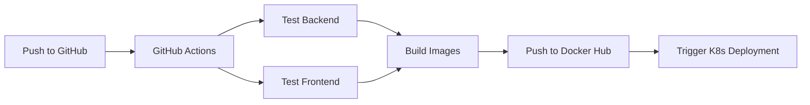
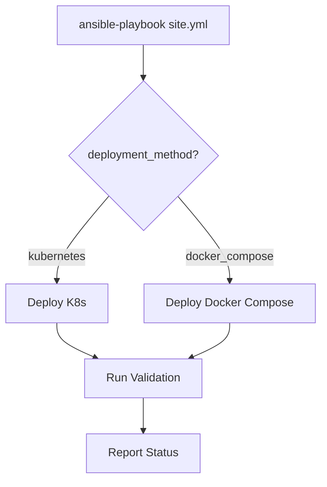

# Virtual Stock Trading App - CI/CD & Deployment Implementation

This project includes comprehensive CI/CD pipelines using **GitHub Actions** and **Jenkins**, plus Kubernetes deployment orchestration via **Ansible**. The setup supports both local development and production deployments.

## 🚀 Quick Start

### GitHub Actions (Automated)
1. Push your code to GitHub
2. The pipeline automatically runs on every push/PR
3. Check the Actions tab in your GitHub repository
4. Images automatically pushed to Docker Hub

### Jenkins (On-Premise)
1. Set up Jenkins on localhost:8080
2. Follow the [Jenkins Setup Guide](docs/JENKINS-SETUP.md)
3. Create a pipeline job using the provided Jenkinsfile

### Kubernetes Deployment (Ansible)
1. Deploy to Docker Desktop K8s: `cd ansible && make deploy DEPLOYMENT_METHOD=kubernetes`
2. Or deploy with Docker Compose: `make deploy DEPLOYMENT_METHOD=docker_compose`
3. See [Ansible README](ansible/README.md) for detailed instructions

## 📁 Project Structure

```
virtual-stock-trader-app/
├── .github/
│   └── workflows/
│       └── ci-cd.yml              # GitHub Actions workflow
├── ansible/
│   ├── site.yml                   # Main Ansible playbook
│   ├── inventory.ini              # Ansible inventory (local/remote hosts)
│   ├── ansible.cfg                # Ansible configuration
│   ├── Makefile                   # Convenient deployment commands
│   ├── README.md                  # Ansible deployment guide
│   ├── requirements.txt           # Python dependencies
│   ├── roles/                     # Ansible roles
│   │   ├── prerequisites/         # System setup role
│   │   ├── docker/               # Docker installation role
│   │   ├── kubernetes/           # K8s deployment role
│   │   ├── docker-compose/       # Docker Compose deployment role
│   │   ├── secrets-vault/        # Secrets management role
│   │   └── monitoring/           # Optional monitoring role
│   ├── tasks/                     # Task orchestration
│   │   ├── main.yml              # Main task flow
│   │   ├── deploy_kubernetes.yml # K8s deployment tasks
│   │   ├── deploy_docker_compose.yml # Docker Compose tasks
│   │   └── validate_deployment.yml   # Post-deployment validation
│   ├── templates/                 # Jinja2 templates
│   │   ├── docker-compose.env.j2 # Environment file template
│   │   └── k8s-secret.yml.j2     # K8s Secret template
│   └── group_vars/                # Host group variables
│       ├── local.yml              # Local deployment settings
│       └── remote.yml             # Remote deployment settings
├── k8s/
│   ├── namespace.yaml             # K8s namespace
│   ├── configmap.yaml             # Application configuration
│   ├── secret.yaml                # Sensitive data (base64 encoded)
│   ├── mysql-deployment.yaml      # MySQL database deployment
│   ├── backend-deployment.yaml    # Backend service deployment
│   ├── frontend-deployment.yaml   # Frontend service deployment
│   ├── ingress.yaml               # Ingress configuration
│   ├── kustomization.yaml         # Kustomize overlay
│   └── README.md                  # K8s deployment guide
├── docs/
│   ├── CI-CD-SETUP.md            # Complete CI/CD setup guide
│   └── JENKINS-SETUP.md          # Jenkins-specific setup guide
├── scripts/
│   ├── deploy.sh                 # Linux/Mac deployment script
│   ├── deploy.ps1                # Windows PowerShell deployment script
│   └── test.sh                   # Testing script
├── docker-compose.yml            # Local development environment
├── docker-compose.ci.yml         # CI/CD testing environment
├── docker-compose.run.yml        # Local development environment
├── docker-compose.prod.yml       # Production environment
├── Jenkinsfile                   # Jenkins pipeline configuration
├── CONTRIBUTING.md               # Contribution guidelines
└── README-CI-CD.md              # This file
```

## 🔧 CI/CD Features

### GitHub Actions Pipeline
- ✅ **Multi-stage pipeline**: Test → Build → Deploy
- ✅ **Parallel testing**: Backend and frontend tests run simultaneously
- ✅ **Docker image building**: Automated image creation and pushing
- ✅ **Environment-specific deployment**: Staging and production
- ✅ **Security scanning**: Dependency vulnerability checks
- ✅ **Caching**: Optimized build times with dependency caching

### Jenkins Pipeline
- ✅ **Declarative pipeline**: Easy to read and maintain
- ✅ **Docker integration**: Full Docker support with health checks
- ✅ **Test reporting**: HTML reports and coverage metrics
- ✅ **Manual approval**: Production deployment requires approval
- ✅ **Parallel builds**: Backend and frontend images built simultaneously
- ✅ **Integration testing**: Full application stack testing

### Kubernetes & Ansible Deployment
- ✅ **Infrastructure as Code**: Complete K8s manifests with Kustomize
- ✅ **Multi-method deployment**: Support for both Kubernetes and Docker Compose
- ✅ **Automated orchestration**: Ansible playbooks for end-to-end deployment
- ✅ **Role-based configuration**: Reusable roles for prerequisites, docker, k8s, etc.
- ✅ **Environment management**: Separate configurations for local and remote deployments
- ✅ **Post-deployment validation**: Automated health checks and verification
- ✅ **Secret management**: Integrated secrets handling with Ansible Vault

## 🐳 Docker Images

The CI/CD pipelines build and push these images to Docker Hub:

- **Backend**: `cavinsam/virtual-stock-trading-app-backend:latest`
- **Frontend**: `cavinsam/virtual-stock-trading-app-frontend:latest`

## 🧪 Testing

### Test Types
1. **Unit Tests**: Individual component testing
2. **Integration Tests**: Full application stack testing
3. **Performance Tests**: Load and stress testing
4. **Security Tests**: Vulnerability scanning

### Running Tests Locally
```bash
# Run all tests
./scripts/test.sh all

# Run specific test types
./scripts/test.sh unit
./scripts/test.sh integration
./scripts/test.sh performance
./scripts/test.sh security
```

## 🚀 Deployment

### Automated Deployment
- **Staging**: Automatically deployed on main branch push
- **Production**: Manual approval required in Jenkins

### Manual Deployment
```bash
# Deploy to staging
./scripts/deploy.sh staging latest

# Deploy to production
./scripts/deploy.sh production v1.0.0
```

### Windows PowerShell
```powershell
# Deploy to staging
.\scripts\deploy.ps1 staging latest

# Deploy to production
.\scripts\deploy.ps1 production v1.0.0
```

## 🔐 Security

### Secrets Management
- **GitHub Actions**: Repository secrets
- **Jenkins**: Credentials plugin
- **Docker Hub**: Access tokens (recommended over passwords)

### Required Secrets
```
DOCKER_USERNAME=your_docker_hub_username
DOCKER_PASSWORD=your_docker_hub_token
MYSQL_ROOT_PASSWORD=your_secure_password
JWT_SECRET=your_jwt_secret_key
ALPHAVANTAGE_API_KEY=your_api_key
```

## 📊 Monitoring

### Health Checks
- **Backend**: `http://localhost:8081/api/auth/test`
- **Frontend**: `http://localhost:3000`
- **API Proxy**: `http://localhost:3000/api/auth/test`

### Logs
```bash
# View all logs
docker-compose logs

# View specific service logs
docker-compose logs backend
docker-compose logs frontend
```

## 🛠️ Setup Instructions

### GitHub Actions Setup
1. Fork/clone this repository
2. Add secrets in GitHub repository settings
3. Push code to trigger the pipeline

### Jenkins Setup
1. Install Jenkins on localhost:8080
2. Install required plugins
3. Configure Docker Hub credentials
4. Create pipeline job using the Jenkinsfile
5. Set up GitHub webhook

### Detailed Setup
- [Complete CI/CD Setup Guide](docs/CI-CD-SETUP.md)
- [Jenkins Setup Guide](docs/JENKINS-SETUP.md)

### Deployment Flow Diagrams

#### GitHub Actions → Docker Hub → Kubernetes


#### Ansible Orchestration


#### Local Development → CI/CD → Production
```
Local Developer
    ↓ (git push)
GitHub
    ↓ (webhook)
GitHub Actions
    ├─ Build & Test
    ├─ Push Images (Docker Hub)
    └─ Trigger Deployment
        ↓
Kubernetes (Docker Desktop)
    ├─ MySQL Pod
    ├─ Backend Pod
    ├─ Frontend Pod
    └─ Health Checks ✓
        ↓
Ready for Production
```

## ☸️ Kubernetes Deployment

### Prerequisites
- Docker Desktop with Kubernetes enabled, OR
- Minikube, Kind, or any Kubernetes cluster
- kubectl configured to access your cluster
- Kustomize (for manifest management)

### Local Kubernetes Setup (Docker Desktop)

1. **Enable Kubernetes**
   - Open Docker Desktop preferences
   - Go to Kubernetes tab
   - Check "Enable Kubernetes"

2. **Verify kubectl**
   ```bash
   kubectl version --short
   kubectl get nodes
   ```

3. **Deploy Application**
   ```bash
   # Using Ansible (recommended)
   cd ansible
   make init
   make deploy DEPLOYMENT_METHOD=kubernetes

   # Or manually with kubectl
   kubectl apply -k k8s/
   ```

4. **Verify Deployment**
   ```bash
   # Check pods
   kubectl get pods -n virtual-stock-trader

   # Check services
   kubectl get services -n virtual-stock-trader

   # View logs
   kubectl logs -n virtual-stock-trader -f deployment/backend
   ```

### Kubernetes Architecture

```
virtual-stock-trader namespace:
├── MySQL StatefulSet (1 replica)
│   └── Port: 3306
├── Backend Deployment (2 replicas)
│   ├── Spring Boot service on port 8081
│   ├── Readiness probe: HTTP /health
│   ├── Liveness probe: HTTP /health
│   └── Startup probe: 120s timeout for slow startup
├── Frontend Deployment (2 replicas)
│   ├── Nginx on port 3000
│   └── Proxies to backend-service:8081
└── ConfigMap & Secrets
    ├── app-config: Database URLs, API keys
    └── app-secrets: Passwords, JWT secret
```

### Kubernetes Manifests

- **namespace.yaml**: Creates `virtual-stock-trader` namespace
- **configmap.yaml**: Application configuration (non-sensitive)
- **secret.yaml**: Sensitive data (base64 encoded)
- **mysql-deployment.yaml**: Database with emptyDir volumes
- **backend-deployment.yaml**: Spring Boot application
- **frontend-deployment.yaml**: React SPA with nginx reverse proxy
- **ingress.yaml**: External access configuration
- **kustomization.yaml**: Overlay for resource management

### Scaling & Monitoring

```bash
# Scale backend replicas
kubectl scale deployment backend --replicas=3 -n virtual-stock-trader

# Monitor pod status
kubectl get pods -n virtual-stock-trader -w

# Check resource usage
kubectl top nodes
kubectl top pods -n virtual-stock-trader

# View pod logs
kubectl logs <pod-name> -n virtual-stock-trader
```

## 🤖 Ansible Automation

### Quick Start

```bash
cd ansible

# Install dependencies
make init

# Deploy to local Kubernetes
make deploy DEPLOYMENT_METHOD=kubernetes

# Or deploy with Docker Compose
make deploy DEPLOYMENT_METHOD=docker_compose

# Preview changes (dry-run)
make check DEPLOYMENT_METHOD=kubernetes

# View help
make help
```

### Deployment Methods

**Kubernetes Deployment:**
```bash
ansible-playbook site.yml \
  -i inventory.ini \
  -e deployment_target=local \
  -e deployment_method=kubernetes
```

**Docker Compose Deployment:**
```bash
ansible-playbook site.yml \
  -i inventory.ini \
  -e deployment_target=local \
  -e deployment_method=docker_compose \
  -e mysql_root_password=your_password \
  -e spring_datasource_password=your_password
```

**Remote Kubernetes Deployment:**
```bash
ansible-playbook site.yml \
  -i inventory.ini \
  -e deployment_target=remote \
  -e deployment_method=kubernetes \
  -e docker_hub_username=your_user \
  -e docker_hub_password=your_token
```

### Ansible Roles

| Role | Purpose | Tasks |
|------|---------|-------|
| **prerequisites** | System setup | Package installation, git clone, user setup |
| **docker** | Container runtime | Docker install, Docker Compose, registry login |
| **kubernetes** | K8s deployment | kubectl/helm install, namespace creation, manifest deploy |
| **docker-compose** | DC deployment | .env generation, service startup, health checks |
| **secrets-vault** | Secret management | K8s Secret creation, encryption, validation |
| **monitoring** | Observability | Prometheus, Grafana, ELK setup (optional) |

### Inventory Management

Edit `inventory.ini` to define deployment targets:

```ini
[local]
localhost ansible_connection=local

[remote]
prod.example.com ansible_user=deploy ansible_ssh_private_key_file=~/.ssh/id_rsa
```

### Environment Variables

Key variables for playbook execution:

```bash
deployment_target=local|remote
deployment_method=kubernetes|docker_compose
mysql_root_password=your_password
spring_datasource_password=your_password
jwt_secret=your_secret_key
docker_hub_username=your_username
docker_hub_password=your_token
```

### Secrets Management

**Using Ansible Vault for encrypted secrets:**

```bash
# Create encrypted vault
ansible-vault create vault.yml

# Edit vault
ansible-vault edit vault.yml

# Run playbook with vault
ansible-playbook site.yml -i inventory.ini --ask-vault-pass
```

**Local environment variables (development):**

```bash
export MYSQL_ROOT_PASSWORD="your_password"
export SPRING_DATASOURCE_PASSWORD="your_password"
export JWT_SECRET="your_secret"
```

### Post-Deployment Validation

Ansible automatically validates deployments:

```
✓ Pod status verification
✓ Frontend health check (HTTP 200)
✓ Backend health check (HTTP 200)
✓ Service connectivity verification
✓ Configuration validation
```

Check validation results in playbook output.

### Advanced Ansible Usage

```bash
# Dry-run (check mode)
make check DEPLOYMENT_METHOD=kubernetes

# Verbose output
ansible-playbook site.yml -i inventory.ini -vvv

# Run specific role only
ansible-playbook site.yml -i inventory.ini --tags docker

# Skip validation
ansible-playbook site.yml -i inventory.ini --skip-tags validate

# List all available tasks
ansible-playbook site.yml --list-tasks
```

See [ansible/README.md](ansible/README.md) for comprehensive documentation.

## 🐛 Troubleshooting

### Kubernetes Issues

**Pods not becoming Ready:**
```bash
# Check pod status and events
kubectl describe pod <pod-name> -n virtual-stock-trader

# View container logs
kubectl logs <pod-name> -n virtual-stock-trader

# Check startup probe configuration
kubectl get pod <pod-name> -n virtual-stock-trader -o yaml | grep -A 10 startupProbe
```

**Common K8s Errors:**
1. **Host not allowed to connect to MySQL**: Check MYSQL_ROOT_HOST=% in Secret
2. **Connection refused on health check**: Verify backend is fully started (120s+)
3. **Frontend cannot reach backend**: Check nginx.conf upstream points to `backend-service:8081`

### Ansible Deployment Issues

**Playbook fails on validation:**
```bash
# Run with verbose output to see which step failed
ansible-playbook site.yml -i inventory.ini -vvv

# Skip validation and check pods manually
ansible-playbook site.yml -i inventory.ini --skip-tags validate
```

**Secrets not found:**
```bash
# Verify vault is set up
ansible-vault create vault.yml

# Run playbook with vault password
ansible-playbook site.yml -i inventory.ini --ask-vault-pass
```

### Docker Compose Issues

**Service health checks failing:**
```bash
# Check service status
docker-compose ps

# View logs
docker-compose logs <service_name>

# Restart services
docker-compose restart

# Full restart
docker-compose down
docker-compose up -d
```

### Common Issues
1. **Docker build failures**: Check Dockerfile syntax and dependencies
2. **Database connection issues**: Verify database container is running
3. **Port conflicts**: Change ports in docker-compose files
4. **Authentication failures**: Check Docker Hub credentials

### Debug Commands
```bash
# Check running containers
docker ps

# Check container logs
docker logs <container_name>

# Check network connectivity
docker network ls

# Check volumes
docker volume ls
```

## ✅ Deployment Checklist

### Pre-Deployment
- [ ] All code changes committed and pushed
- [ ] Tests passing locally and in CI/CD pipeline
- [ ] Docker images building successfully
- [ ] Environment variables configured
- [ ] Secrets configured (passwords, API keys, JWT secret)
- [ ] Database migrations tested
- [ ] Backend health endpoint working

### Kubernetes Deployment Verification
- [ ] Namespace created: `kubectl get ns virtual-stock-trader`
- [ ] MySQL pod running: `kubectl get pods -n virtual-stock-trader | grep mysql`
- [ ] Backend pods running: `kubectl get pods -n virtual-stock-trader | grep backend`
- [ ] Frontend pods running: `kubectl get pods -n virtual-stock-trader | grep frontend`
- [ ] Services created: `kubectl get svc -n virtual-stock-trader`
- [ ] ConfigMap present: `kubectl get cm -n virtual-stock-trader`
- [ ] Secrets present: `kubectl get secret -n virtual-stock-trader`

### Ansible Validation
- [ ] Playbook syntax valid: `ansible-playbook site.yml --syntax-check`
- [ ] Inventory configured correctly: `ansible-inventory -i inventory.ini --list`
- [ ] Vault accessible (if using): `ansible-vault view vault.yml`
- [ ] Dry-run successful: `ansible-playbook site.yml --check`

### Post-Deployment Testing
- [ ] Frontend accessible: `curl http://localhost:3000`
- [ ] Backend health check: `curl http://localhost:8081/health`
- [ ] API endpoint test: `curl http://localhost:8081/api/portfolio`
- [ ] Database connection working (check backend logs)
- [ ] All pods in Ready state: `kubectl get pods -n virtual-stock-trader`

### Production Deployment Checklist
- [ ] Database backups created
- [ ] Rollback plan documented
- [ ] Monitoring/alerting configured
- [ ] SSL/TLS certificates in place
- [ ] DNS records updated (if needed)
- [ ] Load balancer configured
- [ ] Backup and disaster recovery tested

## 📋 Quick Reference Commands

### kubectl Commands
```bash
# Deployment status
kubectl get pods -n virtual-stock-trader
kubectl get services -n virtual-stock-trader
kubectl get deployments -n virtual-stock-trader

# Pod information
kubectl describe pod <pod-name> -n virtual-stock-trader
kubectl logs <pod-name> -n virtual-stock-trader
kubectl exec <pod-name> -it -n virtual-stock-trader -- /bin/sh

# Restart deployments
kubectl rollout restart deployment/backend -n virtual-stock-trader
kubectl rollout restart deployment/frontend -n virtual-stock-trader

# Port forwarding for local access
kubectl port-forward svc/backend-service 8081:8081 -n virtual-stock-trader
kubectl port-forward svc/frontend-service 3000:3000 -n virtual-stock-trader

# View logs
kubectl logs -f deployment/backend -n virtual-stock-trader
kubectl logs --all-containers=true pod/<pod-name> -n virtual-stock-trader
```

### Ansible Commands
```bash
cd ansible

# Common make targets
make help              # Show all available commands
make init              # Initialize environment
make check             # Dry-run deployment
make deploy            # Deploy application
make deploy-k8s        # Deploy to Kubernetes
make deploy-compose    # Deploy with Docker Compose
make clean             # Clean up deployment
make vault-create      # Create encrypted vault
make vault-edit        # Edit encrypted vault
make verbose-deploy    # Deploy with verbose output

# Direct ansible-playbook commands
ansible-playbook site.yml -i inventory.ini --check
ansible-playbook site.yml -i inventory.ini -e deployment_target=local
ansible-playbook site.yml -i inventory.ini -vvv
ansible-playbook site.yml -i inventory.ini --ask-vault-pass
```

### Docker Commands
```bash
# Container management
docker ps                                    # Show running containers
docker logs <container>                      # View container logs
docker exec -it <container> /bin/bash       # Enter container
docker stats                                 # Container resource usage

# Image management
docker images                                # List images
docker pull cavinsam/virtual-stock-trading-app-backend:latest
docker push cavinsam/virtual-stock-trading-app-backend:latest

# Docker Compose
docker-compose up -d                         # Start services
docker-compose down                          # Stop services
docker-compose logs -f                       # Follow logs
docker-compose ps                            # Service status
```

### Security
- Use environment variables for secrets
- Don't commit passwords to version control
- Use Docker Hub access tokens
- Regularly update base images
- Scan for vulnerabilities

### Performance
- Use multi-stage Docker builds
- Cache dependencies in CI/CD
- Use .dockerignore files
- Optimize image sizes
- Use health checks

### Monitoring
- Set up log aggregation
- Monitor resource usage
- Set up alerts for failures
- Track deployment metrics
- Monitor application performance

## 🎯 Next Steps

1. **Set up monitoring and alerting**
2. **Configure automated security scanning**
3. **Implement blue-green deployments**
4. **Set up performance monitoring**
5. **Configure backup strategies**

## 📞 Support

If you encounter any issues:

1. Check the troubleshooting section
2. Review the detailed setup guides
3. Check CI/CD pipeline logs
4. Verify all prerequisites are met

## 🏆 Success Metrics

With this CI/CD setup, you should achieve:

- ✅ **Automated testing** on every code change
- ✅ **Consistent deployments** across environments
- ✅ **Fast feedback loops** for developers
- ✅ **Reliable releases** with proper testing
- ✅ **Easy rollbacks** if issues occur
- ✅ **Security scanning** for vulnerabilities
- ✅ **Performance monitoring** of deployments

---

**Happy Deploying! 🚀**
